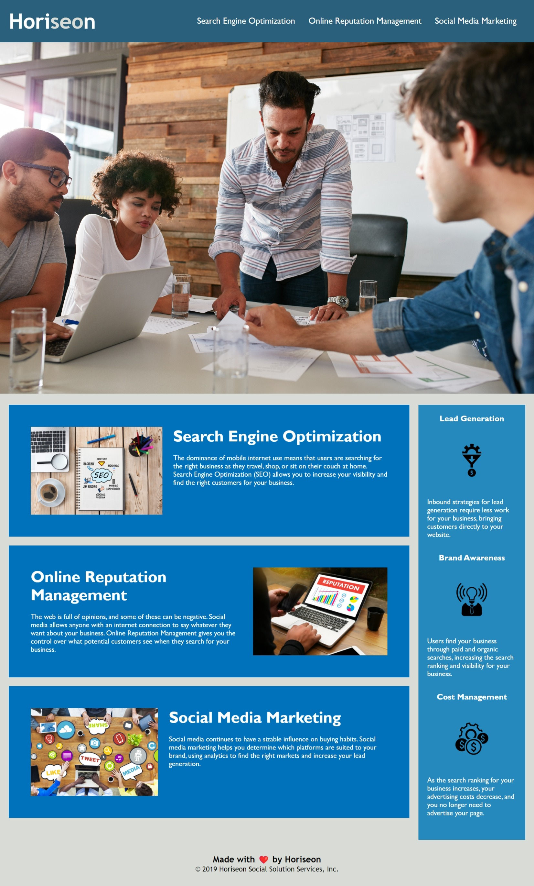

# Horiseon Webpage Refactor

## Description

Horiseon is a marketing agency that offers services for website optimization and management. Horiseon requested to refactor their website to ensure it is more accessible to users. This will improve their website's user comfort and allow people with disabilities to access the website using assistive technologies. Another added benefit of making their website more accessible is imporving their websites position in search engines such as Google.

## Installation
N/A

## Usage

To use Horiseon's website, you can review the descriptions for each of their provided services. For quick access to see the section containing each services, a navigation bar is provided at the top of the page. Clicking on any of the links will take the user to the corresponding section of the webpage. Throughout the webpage, there is a sidebar section to the right of the webpage showcasing supplementary information that is beneficial to the user.

## Credits

Abdelrahman Ahmed https://github.com/AbdelrahmanAhmed605

University of Toronto, BootCampSpot https://courses.bootcampspot.com/courses/2861/assignments/46241?module_item_id=854170

## License

Please refer to the MIT LICENSE in the repo.
